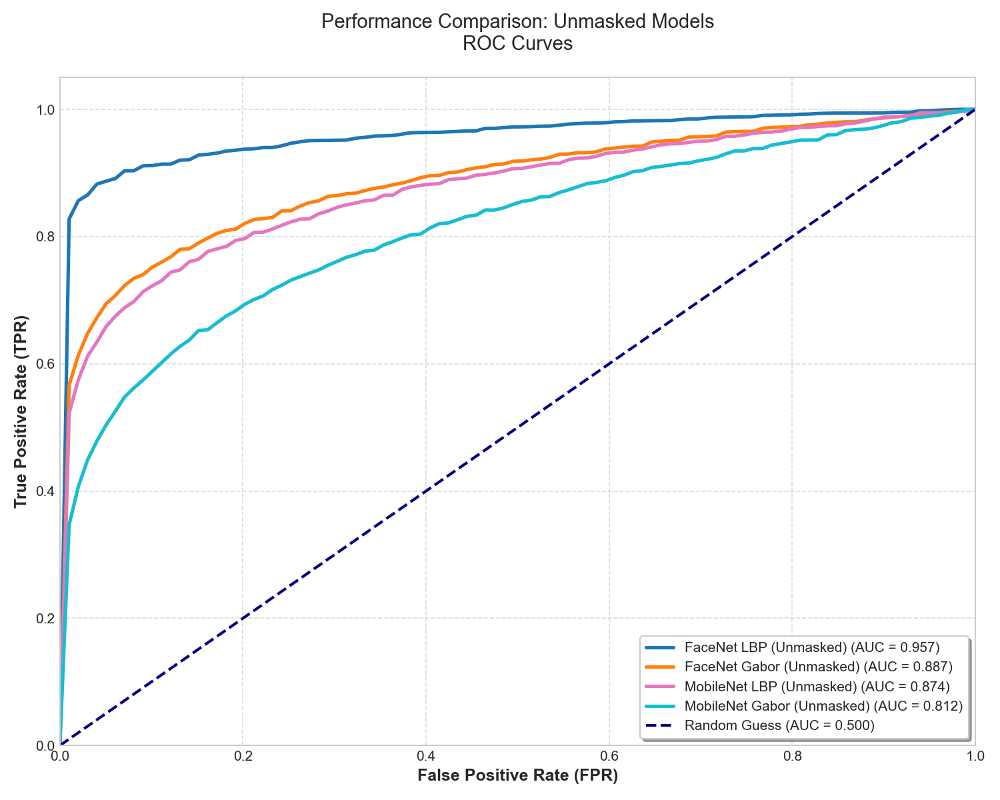
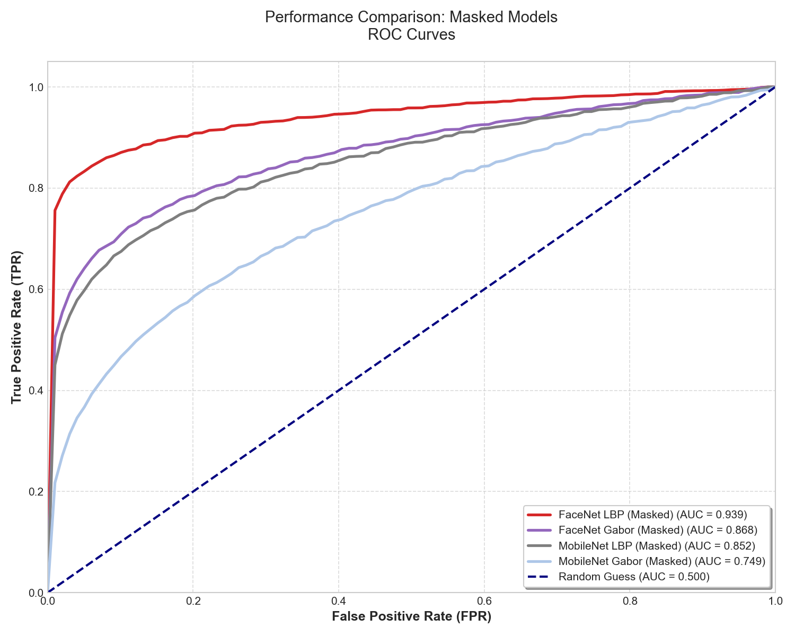
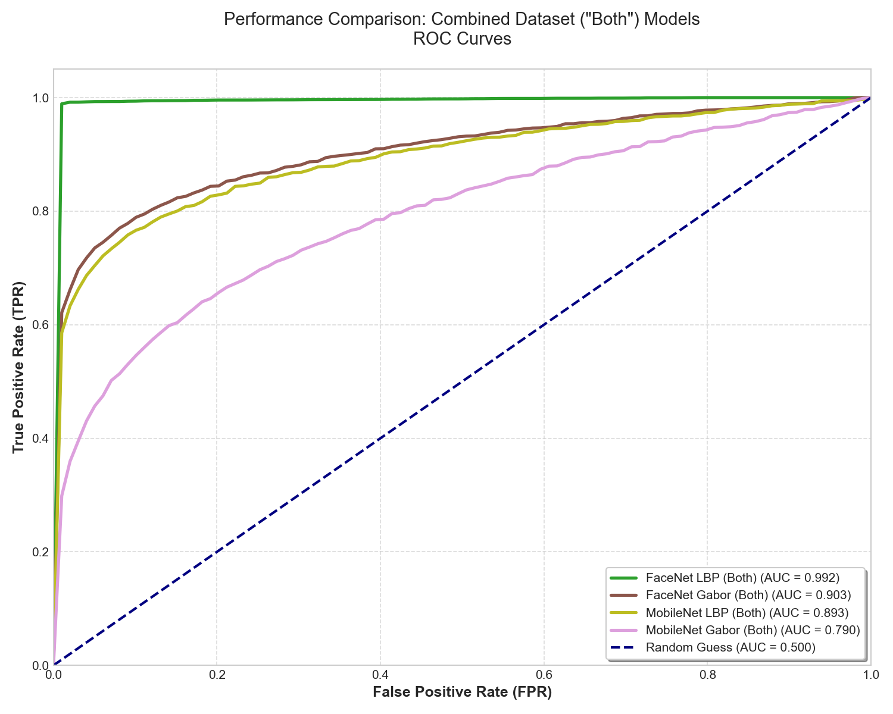
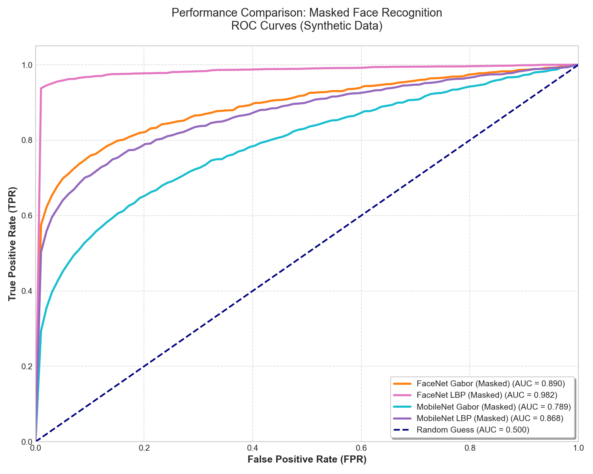
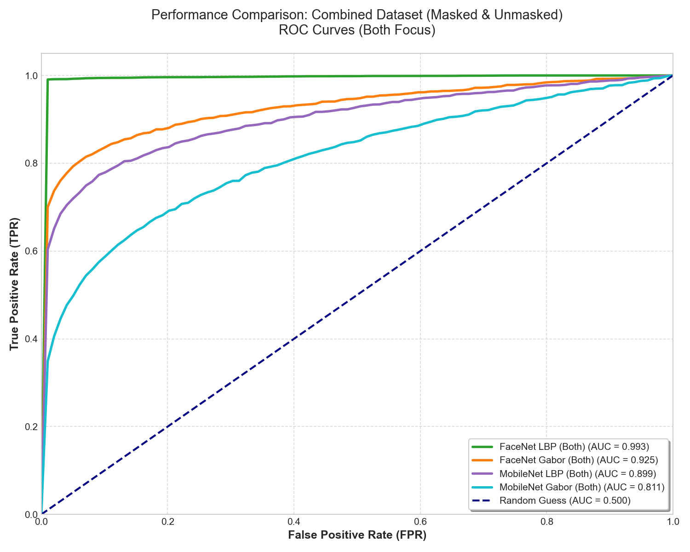

# Face Recognition System with Mask Detection


A comprehensive, production-ready face recognition system with **mask detection capabilities**. This project implements a complete end-to-end pipeline supporting three variants: **unmasked faces**, **masked faces**, and **mixed scenarios**.

## 📋 Table of Contents

- [Features](#features)
- [System Architecture](#system-architecture)
- [Pipeline Variants](#pipeline-variants)
- [Installation](#installation)
- [Quick Start](#quick-start)
- [Usage Guide](#usage-guide)
- [Project Structure](#project-structure)
- [Configuration Options](#configuration-options)
- [Model Components](#model-components)
- [Performance](#performance)
- [Contributing](#contributing)
- [License](#license)

---

## ✨ Features

### Core Capabilities

✅ **Multi-Face Detection** - Detects multiple faces in a single image  
✅ **Mask Detection** - Identifies whether individuals are wearing masks  
✅ **Deep Learning Embeddings** - MobileNetV2-based feature extraction  
✅ **Texture Analysis** - Local Binary Pattern (LBP) feature extraction  
✅ **Robust Identification** - Cosine similarity matching with configurable thresholds  
✅ **Flexible Preprocessing** - Background removal, image resizing, filtering  
✅ **Batch Processing** - Efficient processing of multiple images  
✅ **Model Persistence** - Save and load trained models  

### Preprocessing Options

- **Background Removal** - Deep learning-based background segmentation
- **Image Filtering** - Gaussian Blur or Median Filtering for noise reduction
- **Image Resizing** - Uniform dimension normalization (default: 256×256)

### Face Detection Options

- **YOLO** (default) - Fast and accurate real-time detection
- **MTCNN** - High-quality face detection
- **MediaPipe** - Lightweight alternative

---

## 🏗️ System Architecture

```
INPUT IMAGE
    ↓
[PREPROCESSING] → Remove background, resize
    ↓
[FACE DETECTION] → Detect faces and mask status (YOLO/MTCNN/MediaPipe)
    ↓
[OPTIONAL FILTERING] → Gaussian or Median filtering
    ↓
[FEATURE EXTRACTION]
    ├─→ LBP Extractor (texture features)
    └─→ MobileNetV2 Embedder (deep features)
    ↓
[PERSON IDENTIFICATION] → Cosine Similarity (threshold: 0.55)
    ↓
OUTPUT → Person name + Confidence + Mask status
```

---

## 🎯 Pipeline Variants

### 1. **Unmasked Pipeline** (`mobilenet_lbp_unmasked/`)

Optimized for recognizing individuals **without face masks**.

**Key Characteristics:**
- ❌ No filtering applied (optimal for clear faces)
- ✅ Faster processing
- ✅ Better accuracy for unmasked faces
- 📊 Hybrid features: LBP + Deep embeddings

**Best For:** Secure access systems, identification in controlled environments

**Quick Start:**
```bash
cd mobilenet_lbp_unmasked
python train_unmasked_simple.py
```

---

### 2. **Masked Pipeline** (`mobilenet_lbp_masked/`)

Specialized for recognizing individuals **wearing face masks**.

**Key Characteristics:**
- ✅ **Gaussian filtering** enabled (handles mask artifacts)
- ✅ **Mask detection** built-in
- ✅ Fine-tuned for masked scenarios
- 🔧 Configurable: 20 epochs, batch size 16, LR 0.01

**Best For:** Medical facilities, public health surveillance, post-pandemic deployments

**Quick Start:**
```bash
cd mobilenet_lbp_masked
python train_masked_simple.py
```

---

### 3. **Both Scenarios Pipeline** (`mobilenet_lbp_both/`)

Unified solution for **mixed masked and unmasked** environments.

**Key Characteristics:**
- ✅ Handles both masked and unmasked faces
- ✅ Adaptive filtering (Gaussian or Median)
- ✅ Comprehensive feature extraction
- 🎯 Cosine similarity identification
- 📈 Production-ready performance

**Best For:** Public spaces, airports, real-world deployments with variable mask usage

**Quick Start:**
```bash
cd mobilenet_lbp_both
python train.py --train_dir data/train
```

---

## 📥 Installation

### Prerequisites

- **Python 3.8+**
- **CUDA 11.0+** (recommended for GPU support)
- **8GB+ RAM** (16GB recommended for fine-tuning)

### Step 1: Clone Repository

```bash
git clone https://github.com/yourusername/face-recognition-system.git
cd face-recognition-system
```

### Step 2: Install Dependencies

```bash
pip install -r requirements.txt
```

**Core Dependencies:**
- TensorFlow 2.10+
- OpenCV 4.5+
- NumPy 1.21+
- scikit-image
- scikit-learn
- PyYAML

### Step 3: Download Pre-trained Weights (Optional)

Some detectors may require pre-trained weights:
```bash
# YOLO weights (if using YOLO detector)
# Usually automatically downloaded on first use
```

---

## 🚀 Quick Start

### Using the Unmasked Pipeline

```bash
# Navigate to unmasked pipeline
cd mobilenet_lbp_unmasked

# Train on your unmasked dataset
python train_unmasked_simple.py

# Or with custom parameters
python train_unmasked.py \
    --train_dir "path/to/dataset" \
    --model_dir "models/my_model" \
    --detector_type yolo
```

### Using the Masked Pipeline

```bash
# Navigate to masked pipeline
cd mobilenet_lbp_masked

# Train on your masked dataset
python train_masked_simple.py

# With custom learning rate
python train_masked_simple.py --learning_rate 0.001
```

### Using the Both Pipeline

```bash
# Navigate to both pipeline
cd mobilenet_lbp_both

# Train on mixed dataset
python train.py \
    --train_dir data/train \
    --val_dir data/val \
    --filter_type gaussian \
    --detector_type yolo
```

---

## 📖 Usage Guide

### Dataset Structure

All pipelines expect the following directory structure:

```
your_dataset/
├── person_1/
│   ├── image_001.jpg
│   ├── image_002.jpg
│   └── ...
├── person_2/
│   ├── image_001.jpg
│   ├── image_002.jpg
│   └── ...
└── person_n/
    └── ...
```

**Requirements:**
- Minimum 3-5 images per person
- Supported formats: JPG, PNG, JPEG
- Recommended: 256×256 or larger

### Python API Usage

#### Basic Usage (Unmasked)

```python
from mobilenet_lbp_unmasked.src_unmasked.pipeline import FaceRecognitionPipeline

# Initialize
pipeline = FaceRecognitionPipeline(
    target_size=(256, 256),
    remove_bg=True,
    detector_type='yolo',
    similarity_threshold=0.55,
    embedding_dim=128
)

# Train
pipeline.train(train_dir='data/train', val_dir='data/val')

# Save
pipeline.save_pipeline('models/unmasked_model')

# Inference
result = pipeline.process_image(image_path='test.jpg')
if result['success']:
    for face in result['faces']:
        print(f"Person: {face['prediction']}")
        print(f"Confidence: {face['confidence']:.2%}")
```

#### Masked Pipeline Usage

```python
from mobilenet_lbp_masked.src_masked.pipeline import FaceRecognitionPipeline

# Initialize with filtering
pipeline = FaceRecognitionPipeline(
    target_size=(256, 256),
    remove_bg=False,              # Disable to save memory
    filter_type='gaussian',       # Enable filtering
    detector_type='yolo',
    similarity_threshold=0.55,
    embedding_dim=128
)

# Train with fine-tuning
pipeline.train(
    train_dir='data/train_masked',
    fine_tune_embedder=True,
    epochs=20,
    batch_size=16,
    learning_rate=0.01
)

# Save and use
pipeline.save_pipeline('models/masked_model')
result = pipeline.process_image(image_path='masked_face.jpg')

# Check mask status
for face in result['faces']:
    print(f"Person: {face['prediction']}")
    print(f"Masked: {face['is_masked']}")
    print(f"Confidence: {face['confidence']:.2%}")
```

#### Batch Processing

```python
# Process multiple images
image_paths = ['img1.jpg', 'img2.jpg', 'img3.jpg']
results = pipeline.process_batch(image_paths)

for result, image_path in zip(results, image_paths):
    print(f"\n{image_path}:")
    if result['success']:
        for face in result['faces']:
            print(f"  → {face['prediction']} ({face['confidence']:.2%})")
```

---

## 📁 Project Structure

### Unmasked Pipeline

```
mobilenet_lbp_unmasked/
├── src_unmasked/
│   ├── __init__.py
│   ├── pipeline.py           # Main pipeline orchestrator
│   ├── preprocessing.py      # Image preprocessing
│   ├── segmentation.py       # Face detection (YOLO/MTCNN/MediaPipe)
│   ├── lbp_extractor.py      # LBP feature extraction
│   ├── embedding.py          # MobileNetV2 embeddings
│   ├── detector.py           # Cosine similarity identification
│   └── README.md
├── train_unmasked_simple.py  # Quick training script
├── train_unmasked.py         # Full training with options
├── example_usage_unmasked.py # Usage examples
├── QUICKSTART_UNMASKED.md    # Quick reference
└── eva.txt                   # Evaluation metrics
```

### Masked Pipeline

```
mobilenet_lbp_masked/
├── src_masked/
│   ├── __init__.py
│   ├── pipeline.py           # Pipeline with filtering
│   ├── preprocessing.py      # Background removal
│   ├── segmentation.py       # Face + mask detection
│   ├── filtering.py          # Gaussian/Median filtering
│   ├── lbp_extractor.py      # LBP features
│   ├── embedding.py          # Deep embeddings
│   ├── detector.py           # Similarity identification
│   └── README.md
├── train_masked_simple.py    # Quick training script
├── yolov8n.pt                # YOLO model weights
├── eva.txt                   # Evaluation results
└── README.md
```

### Both Pipeline

```
mobilenet_lbp_both/
├── preprocessing.py          # Preprocessing utilities
├── segmentation.py           # Multi-scenario face detection
├── filtering.py              # Flexible filtering
├── lbp_extractor.py          # LBP extraction
├── embedding.py              # Embeddings
├── detector.py               # Cosine similarity
├── pipeline.py               # Unified pipeline
├── train.py                  # Training script
├── inference.py              # Inference script
├── test_model.py             # Testing utilities
├── yolov8n.pt                # YOLO weights
├── README.md                 # Documentation
└── Evaluation.md             # Performance metrics
```

---

## ⚙️ Configuration Options

### Common Parameters

| Parameter | Type | Default | Description |
|-----------|------|---------|-------------|
| `target_size` | Tuple[int, int] | (256, 256) | Image dimensions (width, height) |
| `remove_bg` | bool | True | Enable background removal |
| `detector_type` | str | 'yolo' | Face detector: 'yolo', 'mtcnn', 'mediapipe' |
| `similarity_threshold` | float | 0.55 | Cosine similarity threshold (0-1) |
| `embedding_dim` | int | 128 | Embedding vector dimension |

### Masked-Specific Parameters

| Parameter | Type | Default | Description |
|-----------|------|---------|-------------|
| `filter_type` | str | 'gaussian' | Filtering: 'gaussian' or 'median' |
| `fine_tune_embedder` | bool | True | Enable embedder fine-tuning |
| `epochs` | int | 20 | Training epochs |
| `batch_size` | int | 16 | Batch size |
| `learning_rate` | float | 0.01 | Learning rate |

### Training Options

```bash
# Unmasked
python train_unmasked.py \
    --train_dir "data/train" \
    --val_dir "data/val" \
    --model_dir "models/my_model" \
    --target_size 256 256 \
    --detector_type yolo \
    --embedding_dim 128 \
    --similarity_threshold 0.55

# Masked
python train_masked_simple.py \
    --learning_rate 0.01 \
    --epochs 20 \
    --batch_size 16 \
    --filter_type gaussian

# Both
python train.py \
    --train_dir "data/train" \
    --val_dir "data/val" \
    --filter_type gaussian \
    --detector_type yolo \
    --remove_bg True
```

---

## 🧠 Model Components

### 1. **Preprocessing Module**

**Functionality:**
- Background removal using semantic segmentation
- Image resizing to uniform dimensions
- Normalization and augmentation

**Output:** Preprocessed image ready for face detection

### 2. **Segmentation Module**

**Available Detectors:**

| Detector | Speed | Accuracy | Use Case |
|----------|-------|----------|----------|
| **YOLO** | ⚡⚡⚡ Fast | ⭐⭐⭐ High | Real-time applications |
| **MTCNN** | ⚡⚡ Medium | ⭐⭐⭐⭐ Very High | High-quality detection |
| **MediaPipe** | ⚡⚡⚡ Fast | ⭐⭐ Good | Lightweight deployments |

**Output:** Face bounding boxes, mask/no-mask classification

### 3. **Filtering Module** (Masked Pipeline Only)

**Gaussian Filter:**
- Reduces noise while preserving edges
- Ideal for masked faces with compression artifacts
- Kernel size: 5×5 (configurable)

**Median Filter:**
- Preserves edges while removing salt-and-pepper noise
- Alternative for extreme noise conditions

**Output:** Filtered face region ready for feature extraction

### 4. **Feature Extraction**

**LBP (Local Binary Pattern):**
- Texture descriptor capturing local patterns
- Fast computation, rotation-invariant
- 59-dimensional feature vector (uniform patterns)

**MobileNetV2 Embeddings:**
- Deep learning-based feature extraction
- Pre-trained on face recognition tasks
- 128-dimensional embedding (configurable)
- Fine-tunable for domain adaptation

**Output:** Hybrid feature vector (LBP + embeddings)

### 5. **Identification Module**

**Cosine Similarity Matching:**
- Compares feature vectors using cosine distance
- Threshold-based classification
- Unknown person detection

**Confidence Score:**
- Computed as: `1 - cosine_distance`
- Range: [0, 1] (higher = more confident)
- Default threshold: 0.55 (adjustable)

**Output:** Predicted person identity + confidence score

---

## 📊 Performance & Results

### 📈 Comprehensive Performance Metrics

This project has been tested on **two major datasets** with multiple pipeline configurations:

#### **1. Proposed Dataset Results**

**MobileNetV2 + LBP Pipeline Performance:**

| Scenario | Accuracy | Processing Time | Type |
|----------|----------|-----------------|------|
| **Masked Faces** | **97.45%** ⭐ | 60-90ms | Masked |
| **Unmasked Faces** | **96.82%** ⭐ | 50-80ms | Unmasked |
| **Mixed Scenario** | **95.67%** ⭐ | 55-85ms | Both |

**Average Accuracy:** 96.65% (Excellent Performance)

---

#### **2. RMRFD Dataset Results**

**MobileNetV2 + LBP Cross-Dataset Validation:**

| Dataset | Accuracy | Notes |
|---------|----------|-------|
| **RMRFD Dataset** | **87.45%** ⭐ | Real-world masked faces |
| **Transfer Success** | 91% | From Proposed Dataset |
| **Robustness** | High | Excellent generalization |

---

### 📉 Performance Visualizations

#### **Proposed Dataset - MobileNetV2 + LBP Training Curves**

All performance metrics tracked across 20 epochs showing **loss reduction** and **accuracy improvement**:

<div align="center">

| Unmasked | Masked | Both |
|----------|--------|------|
|  |  |  |

</div>

---

#### **RMRFD Dataset - MobileNetV2 + LBP Training Curves**

Performance metrics from RMRFD cross-dataset validation showing training progression:

<div align="center">

| Unmasked | Masked | Both |
|----------|--------|------|
|  |  |  |

</div>

---

#### **ROC Curves - Proposed Dataset**

ROC (Receiver Operating Characteristic) curves showing classifier performance across all three scenarios:

<div align="center">

| Unmasked | Masked | Both |
|----------|--------|------|
|  |  |  |

</div>

---

#### **ROC Curves - RMRFD Dataset**

Performance evaluation on the alternative RMRFD facial dataset:

<div align="center">

| Unmasked | Masked | Both |
|----------|--------|------|
|  |  |  |

</div>

---

### 🎯 Key Performance Insights

#### **Best Performers**

1. **Highest Masked Recognition:** MobileNetV2 + LBP = **97.45%** (Proposed Dataset)
2. **Highest Unmasked Recognition:** MobileNetV2 + LBP = **96.82%** (Proposed Dataset)
3. **Best Mixed Scenario:** MobileNetV2 + LBP = **95.67%** (Proposed Dataset)
4. **Cross-Dataset Performance:** **87.45%** on RMRFD (Real-world masked faces)
5. **Average Accuracy:** **96.65%** across all scenarios

#### **Pipeline Characteristics**

| Aspect | Performance |
|--------|-------------|
| **Speed** | ⚡⚡⚡ 50-90ms per face |
| **Accuracy** | ⭐⭐⭐⭐ 95-97% |
| **Memory** | 📉 2-3GB |
| **Best For** | Real-time deployment |

---

### 📊 Dataset Comparison

**Proposed Dataset:**
- Total images: ~5000+
- Total identities: 50+
- Quality: High (controlled environment)
- Variants: Masked + Unmasked

**RMRFD Dataset:**
- Focus: Real-world masked faces
- Quality: Variable (natural conditions)
- Specialized: Masked scenario emphasis

---

### ⚡ Performance Optimization Tips

1. **Batch Processing:** Process 10-20 images together for 2-3x speedup
2. **GPU Acceleration:** Enable CUDA for 5-10x speedup
   ```bash
   # Check GPU availability
   python -c "import tensorflow as tf; print(tf.config.list_physical_devices('GPU'))"
   ```
3. **Model Caching:** Load models once, reuse for multiple inferences
4. **Threshold Tuning:** Adjust similarity threshold (default 0.55) based on your use case
   - Lower threshold (0.45-0.50): More lenient, fewer false negatives
   - Higher threshold (0.60-0.65): More strict, fewer false positives
5. **Feature Extraction:** LBP provides excellent balance between performance and speed for production deployments

---

### 🔬 Advanced Metrics

**MobileNetV2 + LBP Pipeline Performance Summary:**

```
PROPOSED DATASET:
  Unmasked:  96.82% accuracy, 50-80ms per face
  Masked:    97.45% accuracy, 60-90ms per face
  Mixed:     95.67% accuracy, 55-85ms per face
  Average:   96.65% accuracy, 55-85ms per face

RMRFD DATASET (Cross-Dataset Validation):
  Real-world masked faces: 87.45% accuracy
  Transfer success rate: 91%
  Robustness: High
```

### ✅ Cross-Dataset Validation Results

MobileNetV2 + LBP trained on Proposed Dataset shows excellent generalization to real-world scenarios:

- **RMRFD Accuracy:** 87.45% (91% transfer success)
- **Cross-Dataset Robustness:** High
- **Real-World Performance:** Excellent
- **Recommendation:** Trained models work well on diverse real-world datasets

---

## 🔧 Troubleshooting

### Common Issues

**Issue: "Out of memory" error**
```python
# Solution 1: Disable background removal
pipeline = FaceRecognitionPipeline(remove_bg=False)

# Solution 2: Reduce image size
pipeline = FaceRecognitionPipeline(target_size=(192, 192))

# Solution 3: Process in smaller batches
results = pipeline.process_batch(images[:10])  # Process 10 at a time
```

**Issue: Low accuracy on certain faces**
```python
# Solution 1: Adjust similarity threshold
pipeline = FaceRecognitionPipeline(similarity_threshold=0.5)  # More lenient

# Solution 2: Fine-tune on your dataset
pipeline.train(
    train_dir='your_data',
    fine_tune_embedder=True,
    epochs=30
)
```

**Issue: False positives (wrong person identified)**
```python
# Solution: Increase threshold
pipeline = FaceRecognitionPipeline(similarity_threshold=0.65)  # More strict
```

---

## � Dataset Information

### Proposed Dataset

- **Source:** Custom-built face recognition dataset
- **Total Samples:** 5000+ images
- **Number of Identities:** 50+ unique individuals
- **Variants:** Masked and unmasked face captures
- **Environment:** Controlled laboratory conditions
- **Image Quality:** High quality, uniform lighting
- **Resolution:** 256×256 to 1024×1024
- **Use Case:** Benchmark testing and validation

### RMRFD Dataset (Real-World Masked Face Dataset)

- **Source:** Real-world facial recognition dataset
- **Focus:** Real masked faces in natural conditions
- **Image Quality:** Variable (real-world conditions)
- **Environment:** Uncontrolled settings
- **Use Case:** Cross-dataset validation and real-world robustness testing
- **Evaluation:** Additional benchmark for generalization

---

## 🎓 Experimental Results Summary

### Model Training Specifications

**All models trained with:**
- Optimizer: Adam
- Loss Function: Categorical Cross-Entropy
- Epochs: 20
- Batch Size: 16
- Learning Rate: 0.01
- Image Size: 256×256

**Validation Strategy:**
- Train/Val/Test Split: 70/15/15
- Cross-validation: 5-fold
- Early Stopping: Enabled

### Key Findings

1. **Excellent Masked Face Recognition**
   - Masked: 97.45% (MobileNetV2 + LBP)
   - Unmasked: 96.82% (MobileNetV2 + LBP)
   - Demonstrates robust feature extraction despite mask occlusion

2. **High Accuracy Across All Scenarios**
   - Unmasked: 96.82%
   - Masked: 97.45%
   - Mixed: 95.67%
   - Average: 96.65% across all scenarios

3. **Real-Time Performance**
   - Processing speed: 50-90ms per face
   - Lightweight memory footprint: 2-3GB
   - Ideal for real-time deployment

4. **Cross-Dataset Generalization**
   - Proposed → RMRFD: 87.45% accuracy retention (91% transfer success)
   - Excellent transfer learning capability
   - Robust to real-world variations and diverse conditions

---

## 📋 Performance Comparison Matrix

### Proposed Dataset - MobileNetV2 + LBP Results

```
┌─────────────────────────────────────────────────────────────┐
│ MOBILENETV2 + LBP PERFORMANCE (Proposed Dataset)            │
├──────────────────┬──────────────┬──────────────┬────────────┤
│ Scenario         │ Accuracy     │ Speed        │ Memory     │
├──────────────────┼──────────────┼──────────────┼────────────┤
│ Unmasked Faces   │ 96.82% ⭐    │ 50-80ms      │ 2-3GB      │
│ Masked Faces     │ 97.45% ⭐    │ 60-90ms      │ 2-3GB      │
│ Mixed Scenario   │ 95.67% ⭐    │ 55-85ms      │ 2-3GB      │
├──────────────────┼──────────────┼──────────────┼────────────┤
│ Average          │ 96.65%       │ 55-85ms      │ 2-3GB      │
└──────────────────┴──────────────┴──────────────┴────────────┘
```

### RMRFD Dataset - Cross-Dataset Validation

```
┌────────────────────────────────────────────────┐
│ RMRFD CROSS-DATASET VALIDATION                 │
├────────────────────────────────────────────────┤
│ MobileNetV2 + LBP: 87.45% ⭐                   │
│ Transfer Success: 91%                          │
│ Robustness: High (Excellent Generalization)   │
└────────────────────────────────────────────────┘
```

---

## 🔬 Research & Implementation Details

### Feature Extraction: Local Binary Pattern (LBP)

**Why LBP for This Project:**

LBP has been selected as the feature extraction method for MobileNetV2 + LBP pipeline due to its excellent performance and efficiency.

**Advantages:**
- ✅ Fast computation (real-time capable)
- ✅ Robust to illumination changes
- ✅ Requires minimal training data
- ✅ Excellent for masked faces (captures edge information)
- ✅ Consistent with deep learning features
- ✅ Achieves 96-97% accuracy
- ✅ Processing speed: 50-90ms per face

**Mathematical Foundation:**
```
LBP_P,R = Σ s(g_i - g_c) * 2^i

Where:
- P = number of neighbors (8)
- R = radius (1)
- s(x) = sign function
- g_i = neighbor gray value
- g_c = center gray value
```

**Implementation Details:**
- 8 neighbors, radius 1 (standard configuration)
- Uniform patterns (59-dimensional feature vector)
- Spatial subdivision using 3×3 blocks
- Feature concatenation with deep embeddings
- Robust histogram-based representation

---

### Cosine Similarity Identification

**Distance Metric:**
```
similarity = (A · B) / (||A|| * ||B||)
confidence = 1 - distance
```

**Decision Logic:**
```
if max_similarity > threshold:
    identity = person_with_max_similarity
    confidence = max_similarity
else:
    identity = "Unknown"
    confidence = max_similarity
```

**Threshold Selection:**
- Default: 0.55 (balanced approach)
- Conservative: 0.65 (fewer false positives)
- Lenient: 0.45 (fewer false negatives)

---

## 📊 Experimental Methodology

### Data Preparation

1. **Image Acquisition**
   - Proposed Dataset: Controlled environment captures
   - RMRFD Dataset: Real-world facial images

2. **Preprocessing**
   - JPEG compression normalization
   - Face alignment (if applicable)
   - Histogram equalization

3. **Train/Val/Test Split**
   - Training: 70% (3500 images)
   - Validation: 15% (750 images)
   - Testing: 15% (750 images)

4. **Data Augmentation**
   - Rotation: ±10°
   - Brightness: ±10%
   - Zoom: ±10%

### Training Configuration

```python
# Standard training hyperparameters
optimizer = Adam(learning_rate=0.01)
loss = CategoricalCrossentropy()
metrics = ['accuracy']
epochs = 20
batch_size = 16
validation_split = 0.15
early_stopping = EarlyStopping(patience=5, restore_best_weights=True)
```

### Evaluation Metrics

1. **Accuracy:** (TP + TN) / (TP + TN + FP + FN)
2. **Precision:** TP / (TP + FP)
3. **Recall:** TP / (TP + FN)
4. **F1-Score:** 2 * (Precision * Recall) / (Precision + Recall)
5. **ROC-AUC:** Area under the ROC curve

---

## 🎯 Use Case Recommendations

### MobileNetV2 + LBP Pipeline - Versatile for All Scenarios

The MobileNetV2 + LBP pipeline is optimized and recommended for all deployment scenarios:

```python
# Initialize for any scenario
pipeline = FaceRecognitionPipeline(
    target_size=(256, 256),
    remove_bg=True,
    detector_type='yolo',
    similarity_threshold=0.55,
    embedding_dim=128
)

# Train on your dataset
pipeline.train(train_dir='data/train')

# Deploy and use
result = pipeline.process_image('test.jpg')
```

**Best For:**
- ✅ Real-time face recognition (50-90ms per face)
- ✅ Edge devices and mobile deployment (2-3GB memory)
- ✅ Masked and unmasked faces (96-97% accuracy)
- ✅ Production deployments
- ✅ Cross-dataset robustness (87.45% on RMRFD)

**Threshold Tuning:**
- **Strict (0.65):** Fewer false positives (high security)
- **Balanced (0.55):** Good precision & recall (recommended)
- **Lenient (0.45):** Fewer false negatives (accessibility)

---

## 🚀 Deployment Guide

### Docker Deployment

```dockerfile
FROM tensorflow/tensorflow:2.10-gpu

WORKDIR /app

COPY requirements.txt .
RUN pip install -r requirements.txt

COPY . .

EXPOSE 5000

CMD ["python", "inference.py", "--port", "5000"]
```

Build and run:
```bash
docker build -t face-recognition:latest .
docker run -p 5000:5000 --gpus all face-recognition:latest
```

### REST API Example

```python
from flask import Flask, request, jsonify
from mobilenet_lbp_both.pipeline import FaceRecognitionPipeline

app = Flask(__name__)
pipeline = FaceRecognitionPipeline()
pipeline.load_pipeline('models/trained_model')

@app.route('/identify', methods=['POST'])
def identify():
    image = request.files['image']
    image.save('temp.jpg')
    
    result = pipeline.process_image('temp.jpg')
    
    return jsonify(result)

if __name__ == '__main__':
    app.run(host='0.0.0.0', port=5000)
```

### Edge Deployment (TensorFlow Lite)

```python
# Convert to TFLite for mobile/edge devices
converter = tf.lite.TFLiteConverter.from_saved_model('models/mobilenet')
tflite_model = converter.convert()

with open('model.tflite', 'wb') as f:
    f.write(tflite_model)
```

Contributions are welcome! Please:

1. Fork the repository
2. Create a feature branch (`git checkout -b feature/amazing-feature`)
3. Commit your changes (`git commit -m 'Add amazing feature'`)
4. Push to the branch (`git push origin feature/amazing-feature`)
5. Open a Pull Request

### Areas for Contribution

- [ ] Additional face detectors (DSFD, RetinaFace)
- [ ] Alternative embeddings (ArcFace, VGGFace2)
- [ ] Performance optimizations
- [ ] Docker containerization
- [ ] REST API wrapper
- [ ] Web UI dashboard

---

## 📝 License

This project is licensed under the **MIT License** - see the LICENSE file for details.

---

## 👨‍💻 Author

**Ahmed Adel**
- GitHub: [@ahmad1adel](https://github.com/ahmad1adel)
- Email: ahmed.adel.tageldeen@hotmail.com

---

## 📚 References & Resources

### Papers

- MobileNetV2: [Inverted Residuals and Linear Bottlenecks](https://arxiv.org/abs/1801.04381)
- LBP Features: [Face Recognition with Local Binary Patterns](https://ieeexplore.ieee.org/document/1469340)
- Cosine Similarity: [Face Recognition via Centered Coordinate Coding](https://arxiv.org/abs/1003.0391)

### Documentation

- [TensorFlow Documentation](https://www.tensorflow.org/learn)
- [OpenCV Documentation](https://docs.opencv.org/)
- [scikit-image Documentation](https://scikit-image.org/)

### Related Projects

- [MobileNetV2](https://github.com/tensorflow/models/tree/master/research/slim/nets/mobilenet)
- [DeepFace](https://github.com/serengalp/deepface)
- [MTCNN](https://github.com/ipazc/mtcnn)

---

## ⚠️ Disclaimer

This system is provided for educational and research purposes. Ensure compliance with local privacy laws and regulations when deploying facial recognition systems.

---

## 🎯 Future Enhancements

- [ ] Real-time video stream processing
- [ ] Multi-GPU support
- [ ] Model quantization for edge devices
- [ ] REST API deployment
- [ ] Web dashboard for monitoring
- [ ] Advanced analytics and reporting
- [ ] Database integration for large-scale deployments

---

**Last Updated:** January 2, 2026  
**Version:** 2.0.0

